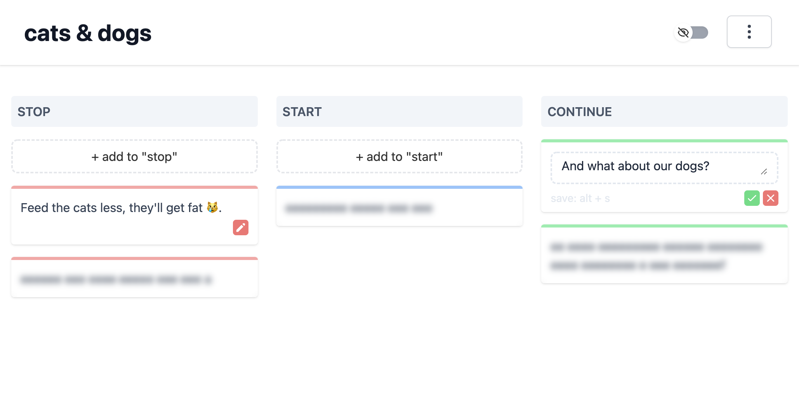

# retroo

A decentralized, end-to-end encrypted, peer-to-peer service to create retro boards. Retroo is build on top of [Svelte](https://github.com/sveltejs/svelte), [tailwindcss](https://github.com/tailwindlabs/tailwindcss) and [GUN](https://github.com/amark/gun).

Visit [retroo.vercel.app](https://retroo.vercel.app) and create your free retroo board.

## preview

